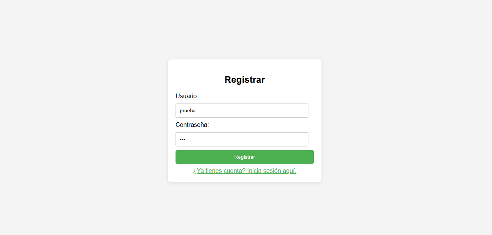
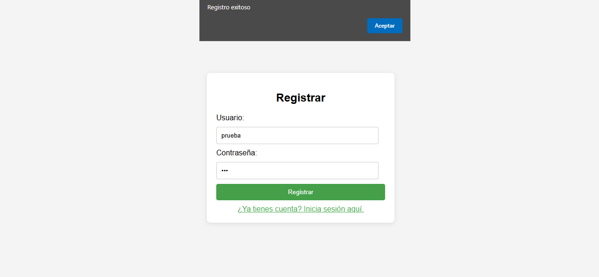
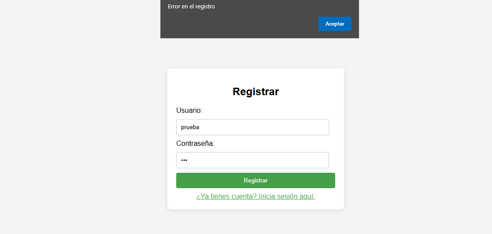
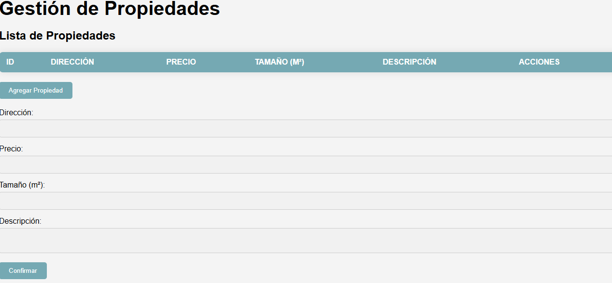
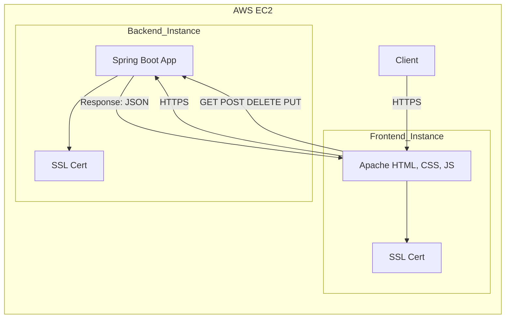
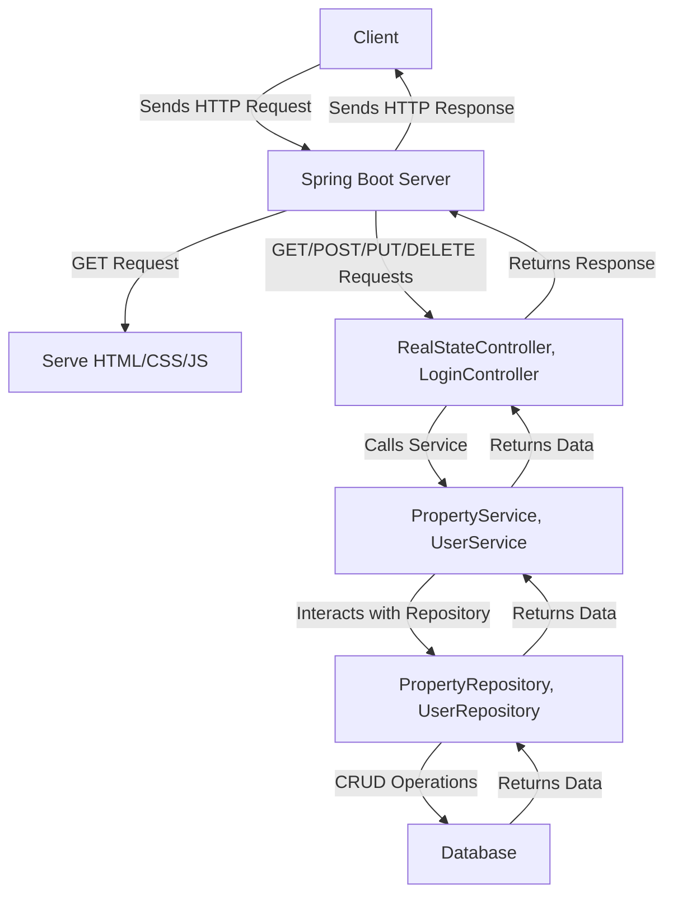
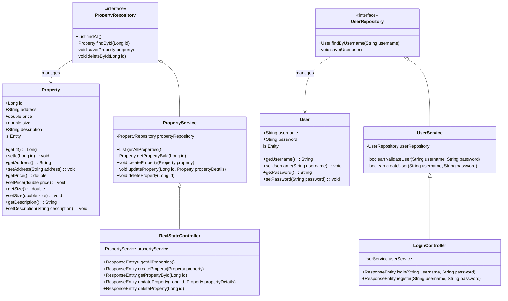
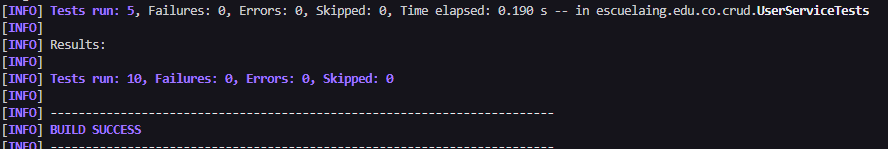

# AREP-LAB06
Autor: David Leonardo Piñeros Cortés
## Taller de Patrones Arquitecturales en la Nube
El objetivo de este taller es integrar un sistema de logeo y registro a la aplicación web anteriormente desarrollada de administración de propiedades inmobiliarias en Spring-Boot, donde el usuario puede consultar, ingresar, editar y eliminar registros. Adicionalmente se quiere desplegar en AWS con dos instancias, una para alojar los archivos del front la cual hará las peticiones a la otra instancia que tendrá todo el backend de la aplicación

## Instalación y Ejecución
Las siguientes instrucciones son para ejecutar el proyecto LOCALMENTE. El primer paso es instalar java, git y maven en su equipo con las siguientes versiones:

* Apache Maven 3.9.6

* Java 17
 
y luego de esto clonar el repositorio desde la terminal de la siguiente manera:

```

git clone https://github.com/leoncico/AREP-LAB06.git

```


Seguido de esto, se ingresa a la carpeta resultante y se ejecutan los siguientes comandos:

* Para compilar el proyecto

```

mvn clean install

```

* Finalmente para ejecutar la aplicación

```

mvn spring-boot:run

```

  

Luego ingresa desde un Browser a la dirección [localhost:8080]() para interactuar con la aplicación web.

  

  

Para probar la funcionalidad clickea en el texto: **¿No tienes cuenta? Regístrate aquí.** A continuación ingrese un usuario y contraseña





La aplicación verifica que no existan usuario duplicados por lo que si se registra con el mismo usuario ocurrirá una excepción



La aplicación guardará la contraseña encriptada con el algoritmo SHA-256.
Posteriormente puede logearse con la cuenta registrada anteriormente y se le redirigirá al módulo de gestión de propiedades



### Despliegue

Se desplegó la aplicación en AWS EC2, donde se tenían dos instancias con apache instalado. Una de las instancias aloja los archivos del front, es decir, html, css y js. La otra instacia ejecuta spring-boot con el todo el backend de la aplicación, incluyendo una base de datos en H2. Para cada instancia se instaló un certificado SSL con la ayuda de la aplicación [Certbot (eff.org)](https://certbot.eff.org/) para que fuese posible ingresar por medio de https, ya sea al front o para realizar las peticiones al back.
Video del despliegue en funcionamiento: https://youtu.be/fKNLOPu5Kbs



## Arquitectura

-   **Cliente (Vista)**: El cliente envía solicitudes HTTP desde una interfaz basada en HTML, CSS y JavaScript. Estas solicitudes pueden ser de tipo `GET`, `POST`, `PUT` o `DELETE` para gestionar propiedades y autenticación. La comunicación entre el cliente y el servidor se realiza a través de `HTTPS`, asegurando que los datos se transmitan de forma segura.
    
-   **Controlador (Controller)**:
    
    -   La clase `RealStateController` es responsable de manejar las solicitudes del cliente relacionadas con las propiedades. Este controlador recibe los datos de entrada, llama al servicio adecuado y devuelve las respuestas correspondientes, generalmente en formato JSON. Las operaciones incluyen obtener todas las propiedades, crear nuevas propiedades, actualizar propiedades existentes y eliminar propiedades.
    -   La clase `LoginController` se encarga de gestionar la autenticación de usuarios. Este controlador recibe las solicitudes de inicio de sesión y registro, valida las credenciales y devuelve el estado correspondiente, como la aceptación de las credenciales o un mensaje de error.
-   **Servicio (Service)**:
    
    -   La lógica de negocio relacionada con las propiedades reside en el `PropertyService`. Esta capa procesa los datos, maneja las reglas de negocio y delega las operaciones CRUD al repositorio. Las funciones en esta clase incluyen la obtención de propiedades, la creación de nuevas propiedades, la actualización de propiedades existentes y la eliminación de propiedades.
    -   El `UserService` maneja la lógica relacionada con la autenticación y gestión de usuarios. Se encarga de validar las credenciales de los usuarios durante el inicio de sesión y de crear nuevos usuarios, asegurando que las contraseñas sean seguras mediante hashing.
-   **Repositorio (Repository)**:
    
    -   `PropertyRepository` es la interfaz que conecta la aplicación con la base de datos, realizando las operaciones de creación, lectura, actualización y eliminación (CRUD) para las propiedades. Esta interfaz utiliza Spring Data JPA para interactuar con la base de datos de forma más sencilla y efectiva.
    -   `UserRepository` se encarga de las operaciones relacionadas con los usuarios, permitiendo encontrar usuarios por nombre de usuario y realizar operaciones CRUD sobre ellos.
-   **Base de Datos**: El repositorio interactúa con la base de datos para almacenar y recuperar la información de las propiedades y usuarios. En este caso, se ha utilizado H2 como base de datos en memoria para facilitar el desarrollo y las pruebas.



A continuación el diagrama de clases:




## Test

Para ejecutar las pruebas ejecute el comando:

```

mvn test

```

Se implementaron las siguientes pruebas:

-   `testCreateUser_Success`: Verifica que un nuevo usuario se crea correctamente.
-   `testCreateUser_UsernameExists`: Verifica que no se puede crear un usuario con un nombre de usuario ya existente.
-   `testValidateUser_Success`: Verifica que un usuario puede ser validado correctamente con credenciales correctas.
-   `testValidateUser_InvalidPassword`: Verifica que un usuario no puede ser validado con una contraseña incorrecta.
-   `testValidateUser_NonExistentUser`: Verifica que un usuario no existente no pueda ser validado.



  

## Build With

- [Spring Boot 3.3.4](https://spring.io/projects/spring-boot) - Framework para el back-end

- [Java](https://www.java.com/) - Lenguaje de programación principal

- [Maven](https://maven.apache.org/) - Gestión de dependencias y automatización de compilación
- [The Apache HTTP Server Project](https://httpd.apache.org/) - Servidor web 

- [HTML5](https://developer.mozilla.org/es/docs/Web/HTML) - Lenguaje de marcado para la estructura y el contenido

- [CSS3](https://developer.mozilla.org/es/docs/Web/CSS) - Estilos

- [JavaScript](https://developer.mozilla.org/es/docs/Web/JavaScript) - Scripting del lado del cliente

- [H2 Database Engine](https://www.h2database.com/html/main.html)  - Base de datos

- [Bootstrap](https://getbootstrap.com/) - Framework CSS para diseño responsivo
  

## Versionado

Version: 1.0

  

## Autor

David Leonardo Piñeros Cortés

  

## Licencia

Este proyecto está bajo la Licencia MIT. Ver el archivo [LICENSE](LICENSE) para más detalles.